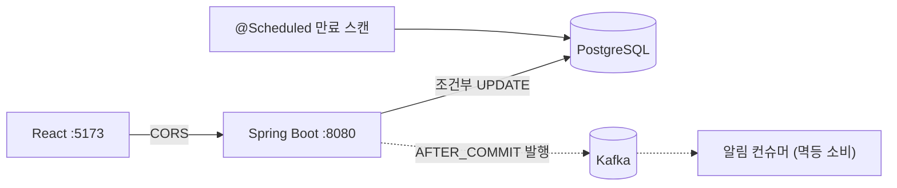

# 수수깡 (susuggang)

수공예 한정 수량 판매 플랫폼 백엔드. 오픈 시점에 특정 상품으로 주문이 집중될 때 재고 이상으로 판매되는 문제(oversell)를 막는 **동시성 제어**가 핵심 주제이며, 세 가지 락 전략을 구현해 부하 테스트로 비교한 뒤 하나를 채택했다.

`Java 21` `Spring Boot 3.5` `PostgreSQL` `Kafka` `Docker Compose` `React(Vite)` `k6`

## 실행

```bash
cp .env.example .env        # 값 생성: openssl rand -hex 32
docker compose up -d --build
```

- API `localhost:8080` · Kafka UI `localhost:8085`
- 프론트: `cd frontend && npm install && npm run dev` → `localhost:5173`
- 데모 흐름: 가입 → 로그인 → 상품 등록(재고 N) → 주문(201) → 재고 소진(409) → 결제 확정(confirm) → 미확정 주문은 TTL 만료 후 재고 자동 복구

## 아키텍처



재고 정합성은 DB 트랜잭션이 보장한다. Kafka는 정합성에 관여하지 않으며, 주문 트랜잭션 뒤의 부가 작업(알림)을 분리하는 역할만 담당한다.

멀티모듈 구성 — 의존 방향은 domain을 향한다:

| 모듈 | 책임 |
|---|---|
| `api` | 실행 모듈(bootJar). 컨트롤러·서비스·JWT/CORS·Kafka |
| `domain` | 엔티티·도메인 규칙. JPA 애노테이션+common만 의존 |
| `infra` | 리포지토리(DB 연동) |
| `common` | 공통 유틸 |

## 동시성 제어

재고 차감은 조회와 갱신 사이에 다른 트랜잭션이 개입하면 oversell이 발생하는 check-then-act 구조다. 세 전략을 모두 구현하고 k6로 비교했다.

> 조건: VU 200 동시 요청, 재고 100, 실험마다 재고 리셋·JVM 웜업 후 측정. 상세: [docs/k6/results.md](docs/k6/results.md)

| 전략 | 성공 주문 | 품절(409) | p95 응답 | 처리량 |
|---|---|---|---|---|
| **조건부 UPDATE (채택)** | **100** | 100 | **41.6ms** | **1,751 req/s** |
| 비관적 락 (FOR UPDATE) | 100 | 100 | 79.7ms | 1,232 req/s |
| 낙관적 락 (@Version+재시도) | 100 | 100 | 81.4ms | 1,268 req/s |

```sql
UPDATE stock SET quantity = quantity - 1
 WHERE product_id = ? AND quantity >= 1   -- 재고 판정을 WHERE로, 성공 여부는 영향 행 수로 판별
```

- 정확성은 세 전략 모두 동일하다(성공 100 = oversell 0). 차이는 성능과 공정성.
- **조건부 UPDATE 채택 근거**: 검사와 차감이 UPDATE 한 번(DB 왕복 1회)으로 끝나 락 대기와 재시도가 없다. p95가 비관적 락의 절반, 처리량 1.4배.
- **낙관적 락 제외 근거**: 동시 200 요청 테스트에서 재시도 585회 발생. 재시도 성공 순서는 도착 순서와 무관해 먼저 온 요청이 반복해서 실패할 수 있다(공정성·기아 문제). 선착순 판매 도메인에 부적합.
- 비관적 락·낙관적 락 구현은 비교군으로 코드에 남겨 두었다(`OrderService`, `OptimisticOrderFacade`).

### 예약·TTL 복구

주문 시점에 재고를 확보해 주는 것이 선착순 판매의 요구사항이므로, 주문 즉시 차감하고(`RESERVED` + `expiresAt`) 결제 확정(`POST /orders/{id}/confirm`) 없이 TTL이 지나면 스케줄러가 재고를 복구한다.

스케줄러가 만료 주문을 조회한 뒤 취소하기 전에 사용자가 confirm하는 경합이 가능하다. 재고 차감과 같은 방식으로, 상태 전이를 조건부 UPDATE로 처리해 해결했다.

```sql
-- confirm: 만료·타인 주문·중복 확정은 WHERE 조건에서 0행으로 거부된다
UPDATE orders SET status = 'COMPLETED'
 WHERE id = ? AND buyer_id = ? AND status = 'RESERVED' AND expires_at > now()

-- 만료 취소: confirm이 먼저 커밋됐으면 0행 → 재고 복구를 수행하지 않는다
UPDATE orders SET status = 'CANCELED'
 WHERE id = ? AND status = 'RESERVED'
```

- 전이가 1행 성공일 때만 재고를 +1 한다. 복구(+1)와 신규 차감(−1)이 같은 재고 행에서 경합해도, 동일 행 UPDATE는 행 락으로 직렬화되고 대기 후 최신 커밋 값으로 WHERE를 재평가하므로 순서와 무관하게 안전하다.
- 만료 스캔은 `@Scheduled` 1분 주기. 만료 판정의 정확성은 전이 쿼리의 WHERE가 보장하므로 스캔 주기는 복구 지연에만 영향을 준다. 복구는 건별 트랜잭션으로 처리해 한 건의 실패가 나머지 복구를 막지 않는다.

## CORS

프론트(5173)와 API(8080)를 별도 오리진으로 구성해 발생하는 CORS 문제를 재현하고 해결했다.

- 차단 주체는 브라우저다. 서버는 정상 응답하며(curl·Postman에서는 재현되지 않음), 브라우저가 응답 헤더 검사 후 JS에 전달하지 않는 것.
- JWT를 `Authorization` 헤더로 전송하므로 preflight(OPTIONS)가 발생하는데, OPTIONS에는 토큰이 실리지 않는다. CORS 처리가 인증보다 뒤에 있으면 preflight가 403으로 실패하고 본 요청 자체가 전송되지 않는다. `CorsFilter`가 인증·인가 필터보다 앞에 오도록 `http.cors()`로 연결해 해결했다.
- 디버깅 시 주의점: `http.cors()`는 `CorsConfigurationSource` 빈을 자동 탐지한다 · preflight 결과는 `Max-Age`만큼 브라우저에 캐시돼 설정 변경이 즉시 반영되지 않을 수 있다.

## 멀티모듈

단일 모듈에서 동작을 검증한 코드를 모듈로 추출하는 방식(code-first)으로 진행했다. 추출 과정의 컴파일 에러로 모듈 간 숨은 의존을 식별할 수 있다.

- `@Entity`는 domain 모듈에 두고 jakarta 스펙 의존까지 허용했다. 순수 도메인(엔티티-매핑 분리)이 원칙이나, JPA 애노테이션은 구현체가 아닌 표준 스펙 의존이라는 점에서 실용선을 택했다.
- 서비스 계층은 `api` 모듈에 배치했다. 진입점이 하나인 규모에서 application 모듈 분리는 과설계로 판단.
- 모듈 분리 후 `@PathVariable` 이름 추론이 깨지는 문제로 컴파일러 `-parameters` 옵션이 런타임 의존임을 확인했다. 컴파일은 통과하고 런타임에만 드러나는 유형이다.

## Kafka

동기 흐름(주문·재고)을 완성한 뒤 추가했다. 정합성은 DB 트랜잭션이 보장하므로 Kafka는 알림 등 부가 작업의 디커플링만 담당한다.

- **AFTER_COMMIT 발행**: 트랜잭션 내부에서 발행하면 롤백된 주문의 이벤트가 발행될 수 있다(유령 이벤트). `@TransactionalEventListener(AFTER_COMMIT)`로 커밋 후에만 발행하며, 커밋 100건=발행 100·롤백 100건=발행 0으로 검증했다.
- 트레이드오프: 커밋 후 발행 전에 프로세스가 종료되면 이벤트가 유실된다. 현재 이벤트는 알림 용도라 에러 로그로 감지하는 수준을 택했고, 유실 비용이 큰 이벤트가 생기면 outbox 패턴으로 전환한다.
- **멱등 소비**: at-least-once에서 중복 배달은 정상 동작이다. 처리 장부(`ProcessedOrder`, orderId PK)로 `existsById` 1차 필터링, 동시 중복은 PK 제약으로 2차 방어한다.
- 파티션 키는 `productId`. 상품 단위 순서 보장과 확장을 가정한 선택으로, 특정 상품 트래픽 집중 시 핫 파티션 가능성은 인지하고 있다.
