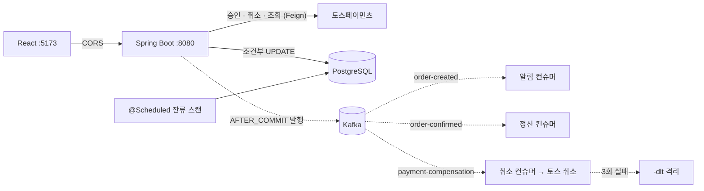
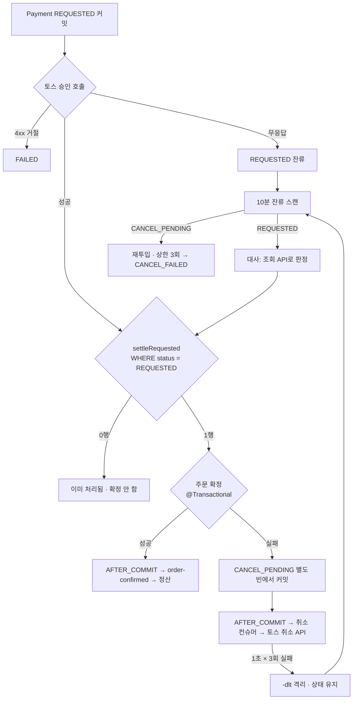

# 수수깡 (susuggang)

한정 수량 수공예품 판매 서버. 토스페이먼츠 승인·취소·조회 API를 실제로 연동한 결제가 중심이다. 승인 왕복을 트랜잭션 밖으로 빼는 대신 그 대가로 생기는 중간 실패 구간을 결제 장부 선기록·보상 취소·조회 대사로 메우고, 장애를 주입해 건수로 검증했다. 재고 차감은 락 3전략을 구현해 비교한 뒤 조건부 UPDATE를 채택했다.

`Java 21` `Spring Boot 3.5` `JPA` `PostgreSQL` `Kafka` `OpenFeign` `토스페이먼츠` `Gradle 멀티모듈` `Docker Compose` `React(Vite)` `k6`

## 실행

```bash
cp .env.example .env        # 값 생성: openssl rand -hex 32
docker compose up -d --build
```

- API `localhost:8080` · Kafka UI `localhost:8085`
- 프론트: `cd frontend && npm install && npm run dev` → `localhost:5173`
- 데모 흐름: 가입 → 로그인 → 상품 등록(재고 N) → 주문(201) → 재고 소진(409) → 결제 확정(confirm) → 정산 내역 반영. 미확정 주문은 TTL 만료 후 재고 자동 복구

## 아키텍처


```mermaid
flowchart LR
  FE["React :5173"] -->|CORS| API["Spring Boot :8080"]
  API -->|"승인 · 취소 · 조회 (Feign)"| TOSS["토스페이먼츠"]
  API -->|"조건부 UPDATE"| DB[("PostgreSQL")]
  API -.->|"AFTER_COMMIT 발행"| K[("Kafka")]
  K -.->|order-created| C1["알림 컨슈머"]
  K -.->|order-confirmed| C2["정산 컨슈머"]
  K -.->|payment-compensation| C3["취소 컨슈머 → 토스 취소"]
  C3 -.->|"3회 실패"| DLT["-dlt 격리"]
  SCH["@Scheduled 잔류 스캔"] --> DB
```

정확성은 DB 트랜잭션이 책임진다. Kafka는 정합성에 관여하지 않고 커밋된 사실의 후속 처리(알림·정산·보상 취소)만 옮긴다. 결과를 모르는 상태는 DB에 남겨 두고 스케줄러가 조회·재투입으로 수렴시킨다.

| 모듈 | 책임 |
|---|---|
| `api` | 실행 모듈(bootJar). 컨트롤러·서비스·결제 정책·Kafka·스케줄러·JWT/CORS |
| `domain` | 엔티티·상태 전이 규칙. JPA 애노테이션+common만 의존 |
| `infra` | 리포지토리(DB 연동) |
| `common` | 공통 유틸 |

## 결제 승인 흐름과 트랜잭션 경계

결제 한 건은 결제위젯 인증 → 서버 승인 호출 → 주문 확정 → 정산 이벤트로 이어진다. 이 가운데 토스 승인 왕복은 하나의 트랜잭션으로 묶지 않는다.

- 응답 타임아웃이 30초라 트랜잭션이 그동안 커넥션을 붙잡으면 동시 요청에서 커넥션 풀(HikariCP 기본 10)이 마른다.
- 토스에서 이미 나간 돈은 롤백해도 되돌아오지 않으므로 묶어도 원자성이 생기지 않는다.

```
POST /payments/confirm
  → 정책 순회 (금액 대조 · 주문 소유자)         트랜잭션 없음
  → Payment REQUESTED 기록 · 커밋
  → 토스 승인 API (연결 3초 · 응답 30초 · 자동 재시도 없음)
  → settleRequested 조건부 UPDATE로 APPROVED 전이
  → 주문 확정 + 정산 이벤트 발행                  @Transactional
```

- 승인 전에 서버 기준가와 대조한다. 결제창 금액은 클라이언트 값이라 조작될 수 있고, 인증(클라이언트 키)과 승인(시크릿 키) 사이가 서버가 검증할 수 있는 유일한 구간이다. 어긋나면 토스를 부르지 않고 400으로 끊는다.
- 토스를 부르기 전에 `REQUESTED`를 커밋한다. 호출 도중 서버가 멈춰도 결제가 시작됐다는 흔적이 남는다. 같은 `paymentKey` 재요청은 기존 행을 이어 쓴다(unique 제약과 세트).
- 장부는 단계마다 커밋한다(`REQUESTED → APPROVED → CANCEL_PENDING → CANCELED`). 한 트랜잭션에 몰면 더티체킹이 최종값만 내보내 중간 상태가 남지 않는다. 잔류 스캔과 대사가 전부 이 중간 상태 위에 선다.
- 정합이 필요한 구간(주문 확정 + 정산 이벤트 발행)만 `@Transactional`로 묶는다.

## 실패 분기와 복구

외부 호출이 트랜잭션 밖에 있으니 실패가 셋으로 갈린다. 거절은 결과를 아는 실패, 무응답은 결과를 모르는 실패, 승인 후 주문 확정 실패는 돈만 나간 상태다.


```mermaid
flowchart TB
    SAVE["Payment REQUESTED 커밋"] --> TOSS{"토스 승인 호출"}
    TOSS -->|"4xx 거절"| F["FAILED"]
    TOSS -->|"무응답"| R["REQUESTED 잔류"]
    TOSS -->|"성공"| UPD{"settleRequested<br/>WHERE status = REQUESTED"}
    UPD -->|"0행"| SKIP["이미 처리됨 · 확정 안 함"]
    UPD -->|"1행"| CONF{"주문 확정<br/>@Transactional"}
    CONF -->|"성공"| EV["AFTER_COMMIT → order-confirmed → 정산"]
    CONF -->|"실패"| CP["CANCEL_PENDING 별도 빈에서 커밋"]
    CP --> CC["AFTER_COMMIT → 취소 컨슈머 → 토스 취소 API"]
    CC -->|"1초 × 3회 실패"| DLQ["-dlt 격리 · 상태 유지"]
    R --> SC["10분 잔류 스캔"]
    DLQ --> SC
    SC -->|"REQUESTED"| RC["대사: 조회 API로 판정"]
    SC -->|"CANCEL_PENDING"| RE["재투입 · 상한 3회 → CANCEL_FAILED"]
    RC --> UPD
```

- **거절**: 토스가 4xx를 주면 `FAILED`로 적는다.
- **무응답 → 조회 대사**: 승인 API에는 멱등성이 없어 재요청이 곧 이중 승인 위험이다. `REQUESTED`를 그대로 두고 10분 주기 스캔이 조회 API(`GET /v1/payments/{paymentKey}`)로 결과를 확인해 `DONE → APPROVED`, `ABORTED`·`EXPIRED → FAILED`, `CANCELED → CANCELED`로 옮긴다. 부분 취소, 식별자·금액 불일치, 조회 실패는 전이 없이 남겨 사람이 본다.
- **승인 후 확정 실패 → 보상 취소**: `CANCEL_PENDING`을 별도 빈(`PaymentCompensationService`)에서 먼저 커밋하고, 커밋 뒤 발행된 이벤트를 컨슈머가 받아 취소 API를 부른다. 사용자 응답은 취소 왕복을 기다리지 않는다. 취소가 실패하면 1초 간격 3회 재시도 뒤 `-dlt` 토픽으로 격리되고 상태는 `CANCEL_PENDING`으로 남아 스캔이 재투입한다. 재투입 3회를 넘기면 `CANCEL_FAILED`로 빼고 사람이 처리한다.
- **단일 승자**: 승인 전이는 `REQUESTED`일 때만 성립하는 조건부 UPDATE다. 영향 행 수가 1인 쪽만 주문 확정으로 들어가고, 0행이면 다른 경로(대사 스캔, 새로고침·더블클릭 재요청)가 이미 처리한 것으로 보고 확정을 진행하지 않는다.

```java
// PaymentRepository
@Modifying(clearAutomatically = true)
@Query("update Payment p set p.status = :status, p.approvedAt = :approvedAt, p.failReason = :failReason " +
        "where p.id = :id and p.status = com.susuggang.domain.PaymentStatus.REQUESTED")
int settleRequested(@Param("id") Long id, @Param("status") PaymentStatus status,
                    @Param("approvedAt") String approvedAt, @Param("failReason") String failReason);
```

재시도를 붙이는 기준은 결과를 아느냐다. `CANCEL_PENDING`은 돈이 나간 것이 확실하고 되돌리기만 못 한 상태라 재시도·격리·재투입·상한을 전부 붙였고, `REQUESTED`는 조회 판정만 한다. 재시도가 붙은 소비는 DB 상태를 판정 기준으로 삼아 멱등하게 만든다. 정산은 `orderId` 자연키 PK로, 취소 컨슈머는 상태 가드(`CANCEL_PENDING`이 아니면 건너뜀)로 중복을 거른다.

## 결제 장애 주입 실측

운영 코드를 바꾸지 않고 토스 클라이언트에만 지연과 오류를 심었다. PostgreSQL과 Kafka는 실제로 띄운 상태이고 판정 기준은 건수다. (`PaymentFaultInjectionTest`, 4건 48초)

| 주입한 장애 | 규모 | 결과 |
|---|---|---|
| 승인 무응답(타임아웃) 동시 | 100건 | 1차 대사 177ms에 90건 판정, 조회 실패 10건은 2차 대사 23ms에 판정 → REQUESTED 잔류 0, 승인 API 재호출 0회(조회 110회) |
| 승인 후 주문 확정 실패(만료) 동시 | 100건 | 사용자 응답 69ms, 전부 CANCELED까지 275ms, 취소 호출 100회로 이중 취소 0 |
| 취소 API 장애(최초+재시도 3회 전부 500) | 10건 | 시도 40회 → DLQ 격리 10건 → 잔류 스캔 재투입 → 복구 후 CANCELED 10, 상한 초과 0 |
| 대사 스캔과 사용자 재요청 동시 경합 | 20건 | 수정 전 정상 결제 오취소 20건, 수정 후 0건 |

네 번째 시나리오가 결함을 드러냈다. 사용자 경로의 승인 전이가 무조건 덮어쓰기라 대사 스캔과 사용자 요청이 둘 다 주문 확정까지 갔고, 뒤늦은 쪽이 `confirmReserved` 0행을 "확정 불가"로 읽어 정상 결제를 환불했다. 승인 전이를 `settleRequested` 조건부 UPDATE로 바꿔 단일 승자만 확정에 들어가게 고쳤다(SSG-47). 표의 ms는 토스 응답 지연을 뺀 서버 처리 시간이고, 3회 실행에서 건수는 모두 같았다.

## 커밋 후 이벤트 발행

- 커밋 전에 Kafka로 나가면 롤백된 주문의 이벤트만 외부에 남는다(유령 이벤트). 트랜잭션 안에서 브로커를 부르면 메시징 장애가 곧 주문 장애가 된다.
- 서비스는 `publishEvent`로 사실만 알리고, Kafka 전송은 `@TransactionalEventListener(AFTER_COMMIT)`가 맡는다. 결합은 스프링 이벤트가 끊고 프로세스 밖 전달은 Kafka가 맡는 2단 구조다. 주문 생성·주문 확정·보상 취소 세 경로가 같은 모양이라 후속 처리가 늘어도 리스너 추가로 끝난다.
- 보상 취소 기록은 별도 빈에서 커밋한다. 같은 클래스 안의 자기 호출은 프록시를 거치지 않아 `@Transactional`이 무시되기 때문이다.
- 스프링 이벤트는 동기이고 같은 스레드에서 돈다. AFTER_COMMIT이 미루는 것은 호출 시점이고, 비동기성은 컨슈머 쪽에서 생긴다.
- 컨슈머 그룹은 알림·정산·취소로 분리해 오프셋과 장애를 격리한다. 파티션 키는 `productId`다. 이벤트에는 ID만 싣고 컨슈머가 소비 시점에 DB를 조회한다.

## 결제 검증 정책 계층

검증이 금액 대조 하나일 때는 서비스 안의 if로 충분했지만, 주문 소유자 검증이 필요해지자 결제 주 흐름을 다시 열어야 했다. 조립의 제어권을 컨테이너로 넘겼다.

```java
public interface PaymentPolicy {
    void check(PaymentConfirmContext context);
}

// PaymentService: @Component 구현체 전부가 List로 주입된다
private final List<PaymentPolicy> policyList;
policyList.forEach(p -> p.check(context));
```

- 정책 추가는 `@Component` 클래스 하나다. 소유자 정책을 나중에 추가한 PR에서 `PaymentService`에 늘어난 것은 컨텍스트 인자 한 줄이고 if 분기는 0줄이다.
- 정책은 리포지토리를 조회하지 않고 받은 컨텍스트만 보고 판정하므로 단위 테스트가 DB 없이 돈다.
- 첫 위반에서 중단한다(fail-fast). 하나라도 어긋나면 외부 승인 호출 자체를 막는 것이 목적이라 위반을 모아 볼 이유가 없다.
- 서비스가 정책 구현체를 직접 참조하면 ArchUnit 테스트(`PolicyArchitectureTest`)가 빌드를 실패시킨다.

## 재고 차감 동시성 제어

재고 차감은 조회와 갱신 사이에 다른 트랜잭션이 개입하면 초과 판매가 나는 check-then-act 구조다. 비관적 락·낙관적 락·조건부 UPDATE 세 전략을 모두 구현하고 k6로 같은 조건에서 비교했다.

> 조건: VU 300이 각 10회(3,000 요청), 재고 1,000, 실험마다 재고 리셋, JVM 웜업 후 측정. 첫 실행(콜드)은 웜업 후보다 p95가 3배 높게 나와 조건에서 제외했다.

| 전략 | 초과 판매 | p95 응답 |
|---|---|---|
| **조건부 UPDATE (채택)** | 0 | **107.7ms** (처리량 5,292 req/s) |
| 비관적 락 (FOR UPDATE) | 0 | 120.8ms |
| 낙관적 락 (@Version+재시도) | 0 | 215.9ms |

```sql
UPDATE stock SET quantity = quantity - 1
 WHERE product_id = ? AND quantity >= 1   -- 재고 판정을 WHERE로, 성공 여부는 영향 행 수로
```

- 정확성은 셋 다 같다. 차이는 지연과 공정성이다. 조건부 UPDATE는 검사와 차감이 UPDATE 한 번으로 끝나 락 대기와 재시도가 없다.
- 낙관적 락은 재시도 성공 순서가 도착 순서와 무관해 먼저 온 요청이 반복해서 질 수 있다. 선착순 판매 도메인에서 제외했다. 비교군 구현은 코드에 남겨 두었다(`OptimisticOrderFacade`).
- 주문은 재고 즉시 차감과 함께 `RESERVED`(10분 만료)로 시작하고 1분 주기 스케줄러가 만료분을 취소하며 재고를 복구한다. 확정·만료 전이가 전부 상태 가드가 붙은 조건부 UPDATE라 둘이 동시에 도착해도 승자는 하나다.

## 멀티모듈

단일 모듈에서 동작을 검증한 코드를 모듈로 추출하는 방식(code-first)으로 진행했다. 추출 과정의 컴파일 에러로 모듈 간 숨은 의존을 식별할 수 있다.

- `@Entity`는 domain 모듈에 두고 jakarta 스펙 의존까지 허용했다. 순수 도메인(엔티티-매핑 분리)이 원칙이나, JPA 애노테이션은 구현체가 아닌 표준 스펙 의존이라는 점에서 실용선을 택했다.
- 서비스 계층은 `api` 모듈에 배치했다. 진입점이 하나인 규모에서 application 모듈 분리는 과설계로 판단.
- 모듈 분리 후 `@PathVariable` 이름 추론이 깨지는 문제로 컴파일러 `-parameters` 옵션이 런타임 의존임을 확인했다. 컴파일은 통과하고 런타임에만 드러나는 유형이다.

## CORS

프론트(5173)와 API(8080)를 별도 오리진으로 구성해 발생하는 CORS 문제를 재현하고 해결했다.

- 차단 주체는 브라우저다. 서버는 정상 응답하며(curl·Postman에서는 재현되지 않음), 브라우저가 응답 헤더 검사 후 JS에 전달하지 않는 것.
- JWT를 `Authorization` 헤더로 전송하므로 preflight(OPTIONS)가 발생하는데, OPTIONS에는 토큰이 실리지 않는다. CORS 처리가 인증보다 뒤에 있으면 preflight가 403으로 실패하고 본 요청 자체가 전송되지 않는다. `CorsFilter`가 인증·인가 필터보다 앞에 오도록 `http.cors()`로 연결해 해결했다.
- 디버깅 시 주의점: `http.cors()`는 `CorsConfigurationSource` 빈을 자동 탐지한다 · preflight 결과는 `Max-Age`만큼 브라우저에 캐시돼 설정 변경이 즉시 반영되지 않을 수 있다.

## 한계

- **커밋과 발행 사이의 유실.** AFTER_COMMIT은 유령 이벤트는 막지만 발행 유실은 막지 못한다. 지금은 DB 상태가 재발행 큐 역할을 한다. `CANCEL_PENDING`이 10분 넘게 남으면 스캔이 보상 토픽으로 재투입하고, 확정됐는데 정산 장부가 없는 주문도 같은 방식으로 재발행한다. 아웃박스는 유실이 곧 금전 손실이 되는 구간이 생길 때 도입한다.
- **스케줄러 중복 실행 방지가 없다.** 인스턴스를 두 대로 올리면 두 대가 같은 주기를 돈다. 돈은 조건부 UPDATE와 상태 가드로 두 번 움직이지 않지만 재투입 횟수가 한 주기에 두 번씩 올라 상한에 빨리 닿는다. ShedLock처럼 DB 락 행으로 한 대만 돌게 하는 것이 표준이다.
- **서킷 브레이커를 넣지 않았다.** 외부 의존이 토스 하나라 타임아웃, 승인 무재시도, 상태 기계로 대응했다.
